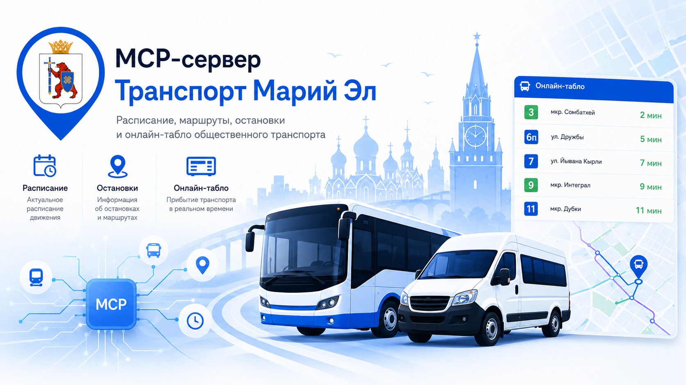

# transport12-mcp



MCP-сервер для HTTP API `transport12`.

Сервер не обращается напрямую к внешним транспортным источникам. Все данные берутся через API основного сервиса `transport12`.

## Scope

В MCP входят только транспортные и справочные сценарии, полезные внешним AI-клиентам:

- остановки и ближайшие остановки;
- маршруты и остановки маршрута;
- фактическое прибытие транспорта на остановку;
- транспорт онлайн на маршруте;
- прогноз движения конкретной машины;
- направления и рейсы автовокзала;
- диагностика доступности API.

В MCP намеренно не входят:

- избранное, потому что оно привязано к пользователям Telegram/VK и БД;
- выбор языка и локализованные ответы;
- главное меню и бот-сценарии Telegram/VK.

## Настройка

```bash
pnpm install
pnpm run build
```

Переменная окружения:

```text
TRANSPORT12_API_BASE_URL=https://your-transport12-api.example
```

## Запуск

```bash
pnpm start
```

## Tools

- `health` - проверить доступность API;
- `search_stops` - найти остановки по названию;
- `find_nearby_stops` - найти ближайшие остановки по координатам;
- `get_stop_routes` - получить маршруты остановки;
- `get_stop_arrivals` - получить фактическое прибытие транспорта на остановку;
- `search_routes` - найти маршруты;
- `get_route` - получить маршрут;
- `get_route_stops` - получить остановки маршрута;
- `get_route_vehicles` - получить транспорт на линии;
- `get_vehicle_forecast` - получить прогноз движения конкретной машины;
- `search_bus_station_destinations` - найти направления автовокзала;
- `get_bus_station_races` - получить рейсы автовокзала на дату.
